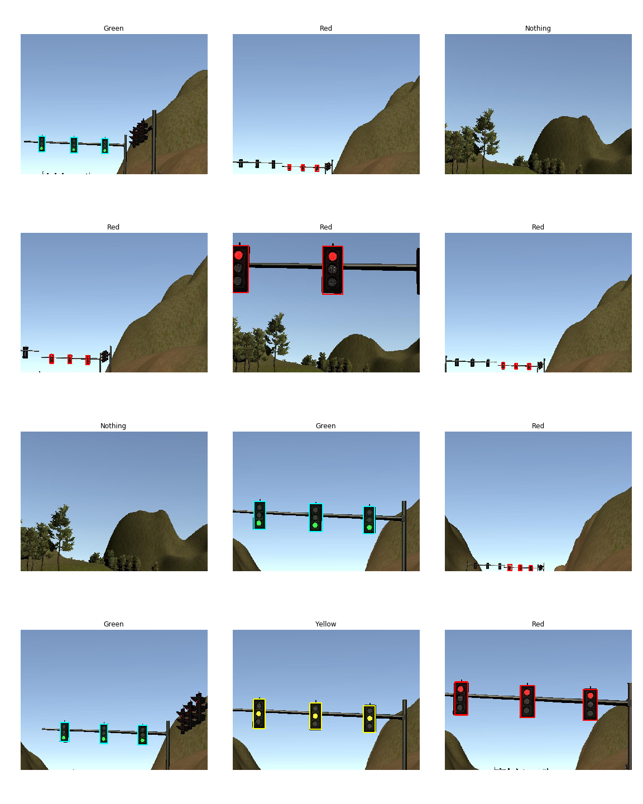

# Self-Driving Car using ROS  
#### Udacity Self-Driving Car Engineer Nanodegree --- Capstone Project


## Team 4Tzones
  

|     Team Member     |            Email             |                                  LinkedIn                                            |                      GitHub                       |   
|        :---:        |            :---:             |                                    :---:                                             |                       :---:                       |  
| Mohamed Elgeweily   | mohamed.elgeweily@gmail.com  | [mohamed-elgeweily-05372377](https://www.linkedin.com/in/mohamed-elgeweily-05372377) | [Elgeweily](https://github.com/Elgeweily)         |  
| Jerry Tan Si Kai    | jerrytansk@gmail.com         | [thejerrytan](https://www.linkedin.com/in/thejerrytan)                               | [thejerrytan](https://github.com/thejerrytan)     |  
| Karthikeya Subbarao | karthikeya108@gmail.com      | [karthikeyasubbarao](https://www.linkedin.com/in/karthikeyasubbarao)                 | [Karthikeya108](https://github.com/Karthikeya108) |    
| Pradeep Korivi      | pradeepkorivi@gmail.com      | [pradeepkorivi](https://www.linkedin.com/in/pradeepkorivi)                           | [pkorivi](https://github.com/pkorivi)             |  
| Sergey Morozov      | sergey@morozov.ch            | [ser94mor](https://www.linkedin.com/in/ser94mor)                                     | [ser94mor](https://github.com/ser94mor)           |  

All team members contributed equally to the project.

*4Tzones* means "Four Time Zones" indicating that team members were located in 4 different time zones 
while working on this project. The time zones range from UTC+1 to UTC+8.


## Software Architecture
  

Note that obstacle detection is not implemented for this project.


## Traffic Light Detection Node

A large part of the project is to implement a traffic light detector/classifier that recognizes 
the color of nearest upcoming traffic light and publishes it to /waypoint_updater node so it can prepare 
the car to speed up or slow down accordingly. Because the real world images differ substantially from simulator images, 
we tried out different approaches for both. The approaches which worked best are described below.

### Simulator (Highway) --- OpenCV Approach
In this approach we used the basic features of OpenCV to solve the problem, the steps are described below.
* Image is transformed to HSV colorspace, as the color feature can be extracted easily in this colorspace.
* Mask is applied to isolate red pixels in the image. 
* Contour detection is performed on the masked image.
* For each contour, area is checked, and, if it falls under the approximate area of traffic light, 
polygon detection is performed and checked if the the number of sides is more than minimum required closed loop polygon. 
* If all the above conditions satisfy there is a red sign in the image. 

#### Pros
* This approach is very fast.
* Uses minimum resources.

#### Cons
* This is not robust enough, the thresholds need to be adjusted always.
* Doesnt work properly on real world data as there is lot of noise. 

### Real World (Test Lot) --- YOLOv3-tiny (You Only Look Once)
We used this approach for real world.
TODO:write about it

### Real World (Test Lot) --- SSD (Single Shot Detection)
We need to solve both object detection - where in the image is the object, 
and object classification --- given detections on an image, classify traffic lights. 
While there are teams who approached it as 2 separate problems to be solved, 
recent advancements in Deep Learning has developed models that attempt to solve both at once.
For example, SSD (Single Shot Multibox Detection) and YOLO (You Only Look Once).

We attempted transfer learning using the pre-trained SSD_inception_v2 model trained on COCO dataset, 
and retrain it on our own dataset for NUM_EPOCHS, achieving a final loss of FINAL_LOSS.

Here is a sample of the dataset.


Sample dataset for simulator images


Here are the results of our trained model.
(Insert image here!)


### Dataset


#### Image Collection
We used images from 3 ROS bags provided by Udacity:
* [traffic_lights.bag](https://s3-us-west-1.amazonaws.com/udacity-selfdrivingcar/traffic_light_bag_file.zip)
* [just_traffic_light.bag](https://drive.google.com/file/d/0B2_h37bMVw3iYkdJTlRSUlJIamM/view?usp=sharing) 
* [loop_with_traffic_light.bag](https://drive.google.com/file/d/0B2_h37bMVw3iYkdJTlRSUlJIamM/view?usp=sharing)


#### Image Extraction
As described in 
[How to export image and video data from a bag file](http://wiki.ros.org/rosbag/Tutorials/Exporting%20image%20and%20video%20data),
we:
```xml
<!--Replace <path-to-your-ros-bag> with the actual path to your ROS bag from which you want to extract images.-->
<!--Replace <topic> with the actual topic that contains images of your interest.-->
<launch>
  <node pkg="rosbag" type="play" name="rosbag" required="true" args="<path-to-your-ros-bag>"/>
  <node name="extract" pkg="image_view" type="extract_images" respawn="false" required="true" output="screen" cwd="ROS_HOME">
    <remap from="image" to="<topic>"/>
  </node>
</launch>
```
1. Prepared the environment by executing: `roscd image_view && rosmake image_view --rosdep-install`.
2. Created an `extract-images-from-ros-bag.launch` file (above).
    - For [traffic_lights.bag](https://s3-us-west-1.amazonaws.com/udacity-selfdrivingcar/traffic_light_bag_file.zip) 
      ROS bag we used `/image_color` topic.  
    - For [just_traffic_light.bag](https://drive.google.com/file/d/0B2_h37bMVw3iYkdJTlRSUlJIamM/view?usp=sharing) and
      [loop_with_traffic_light.bag](https://drive.google.com/file/d/0B2_h37bMVw3iYkdJTlRSUlJIamM/view?usp=sharing) 
      we used `/image_raw` topic.
3. Ran: `roslaunch extract-images-from-ros-bag.launch`.
4. Created a folder to keep extracted images in: `mkdir <folder>`.
5. Moved extracted images to the newly created folder: `mv ~/.ros/frame*.jpg <folder>`


#### Videos Creation
Images extracted from the ROS bags in the [Image Extraction](#image-extraction) step can be converted to videos
following the instructions from 
[How to export image and video data from a bag file](http://wiki.ros.org/rosbag/Tutorials/Exporting%20image%20and%20video%20data).  
We:  
1. Prepared the environment by executing: `sudo apt install mjpegtools`.
2. Ran:
`ffmpeg -framerate 25 -i <folder>/frame%04d.jpg -c:v libx264 -profile:v high -crf 20 -pix_fmt yuv420p <output>`,
where `<folder>` is a directory with files extracted from a particular ROS bag and `<output-name>` is a desired name 
for your MP4 videos file (the file should have the `.mp4` extension).

Below is a video archive containing 3 videos, each corresponding to one of the ROS bags mentioned in 
the [Image Collection](#image-collection) section. The archive is called "4Tzones Traffic Lights Videos" and 
is licensed under the
[Creative Commons Attribution-ShareAlike 4.0 International (CC BY-SA 4.0)](https://creativecommons.org/licenses/by-sa/4.0/) 
license.
|                        |  4Tzones Traffic Lights Videos   |    
|------------------------|    :------------------------:    |    
| Link                   | https://yadi.sk/d/DhyGqahR-NWtEA |  
| License                | [CC BY-SA 4.0](https://creativecommons.org/licenses/by-sa/4.0/) |  
| [traffic_lights.bag](https://s3-us-west-1.amazonaws.com/udacity-selfdrivingcar/traffic_light_bag_file.zip)   | traffic_lights.mp4          |    
| [just_traffic_light.bag](https://drive.google.com/file/d/0B2_h37bMVw3iYkdJTlRSUlJIamM/view?usp=sharing)      | just_traffic_light.mp4      |    
| [loop_with_traffic_light.bag](https://drive.google.com/file/d/0B2_h37bMVw3iYkdJTlRSUlJIamM/view?usp=sharing) | loop_with_traffic_light.mp4 |    


#### Image Annotation
We used a [Yolo_mark](https://github.com/AlexeyAB/Yolo_mark) tool to label the extracted images. 
The annotated dataset which is called "4Tzones Traffic Lights Dataset" is available under the 
[Creative Commons Attribution-ShareAlike 4.0 International (CC BY-SA 4.0)](https://creativecommons.org/licenses/by-sa/4.0/) 
license.

|      \* & \*\*         |  4Tzones Traffic Lights Dataset  |  
|------------------------|    :------------------------:    |  
| Link                   | https://yadi.sk/d/a1Kr8Wmg0zfa0A |
| License                | [CC BY-SA 4.0](https://creativecommons.org/licenses/by-sa/4.0/) |
| Total TL # of Samples  | 2795                             |
| Red TL # of Samples    | 682                              |
| Yellow TL # of Samples | 267                              |
| Green TL # of Samples  | 783                              |
| No TL # of Samples     | 1063                             |

\* TL stands for "Traffic Lights" and # stands for "Number."  
\*\* Notice that the total number of images contained in the ROS bags mentioned above is a little bigger. 
We removed all images that are ambiguous, e.g., two traffic light bulbs are simultaneously ON, 
or the image border partially cuts traffic light.

#### Image Augmentation
We tried different neural network models for traffic lights detection and classification. We first used the data
obtained during the [Image Annotation](#image-annotation) step. Models trained on these data did not perform well
enough on the videos of similar track but from different ROS bags.

    
### Other approaches for traffic light detection

We experimented with few other (unsuccessful) approaches to detect traffic light. 

#### Idea

The idea is to use the entire image with a given traffic light color as an individual class. This means we will have 4 classes

 1. Entire image showing `yellow` traffic sign 
 2. Entire image showing `green` traffic sign 
 3. Entire image showing `red` traffic sign 
 4. Entire image showing `no` traffic sign 

#### Models

We trained couple of models:

1. A simple CNN with two convolutional layers, a fully connected layer and an output layer. The initial results looked promising with `training accuracy > 97%` and `test accuracy > 90%`. However when we deployed and tested the model, the results were not consistent. The car did not always stop at red lights and sometimes it did not move even when the lights were green. Efforts to achieve higher accuracies were in vain. 

2. Used transfer learning for multi-class classification approach using `VGG19` and `InceptionV3` models, using `imagenet` weights. The network did not learn anything after `1-2` epochs and hence the training accuracy never exceeded `65%`.


### Learning Points


### Future Work


### Acknowledgements

- We would like to thank Udacity for providing the instructional videos and learning resources.
- We would like to thank Alex Lechner for his wonderful tutorial on how to do transfer learning on TensorFlow Object Detection API research models and get it to run on older tensorflow versions, as well as providing datasets. You can view his readme here: https://github.com/alex-lechner/Traffic-Light-Classification/blob/master/README.md#1-the-lazy-approach
